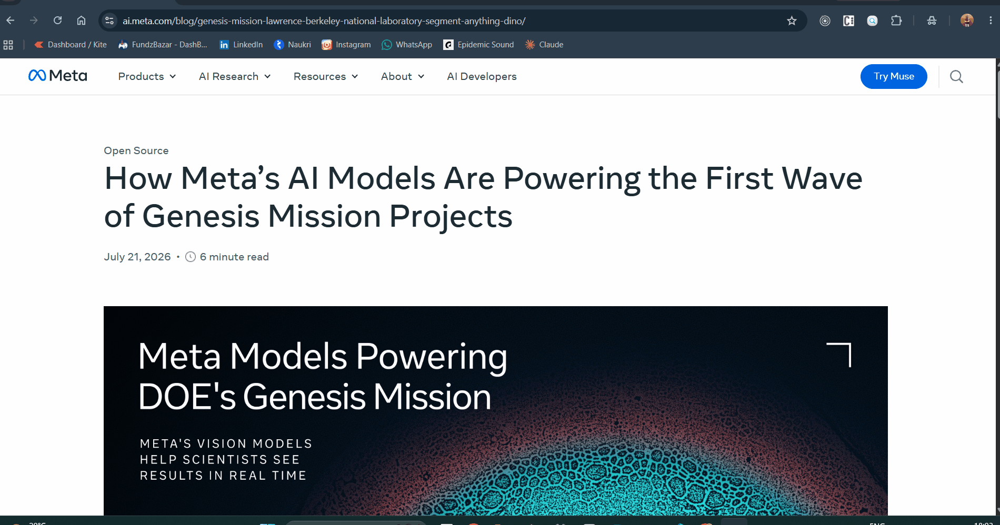

# Explain This ✨

A Chrome extension that explains or summarizes any text you select on the web — right-click, and get an AI-generated explanation in a clean popup, powered by Google's Gemini API.



## Why I built this

I wanted to learn how Chrome extensions actually work under the hood — manifest configuration, content scripts, background service workers, and how they communicate — while building something genuinely useful with a tech stack I already knew (React + Tailwind). This project also let me practice designing around a real external API and thinking through basic security (no hardcoded secrets, user-provided API keys).

## Features

- **Right-click any selected text** on any webpage → "Explain this"
- AI-generated explanation rendered with proper formatting (bold, bullet points)
- Clean, custom-designed popup UI (not a stock template)
- Copy explanation to clipboard with one click
- No backend, no database — fully client-side, API key stored locally and never leaves your browser except to call Gemini directly
- Options page to securely add your own free Gemini API key

## Tech stack

- **Chrome Extension:** Manifest V3, Context Menus API, Background Service Worker, `chrome.storage`
- **UI:** React + Vite + Tailwind CSS v4
- **AI:** Google Gemini API (`gemini-3.6-flash`)

## How it works

1. A background service worker registers a context menu item that appears only when text is selected (`contexts: ["selection"]`)
2. When clicked, the selected text is sent to the Gemini API directly from the background worker
3. The result is written to `chrome.storage.local`, which the popup listens to in real time via `chrome.storage.onChanged` — so the popup shows a live "loading → done" state instead of a static result
4. The popup (a separate React app, built with Vite) reads and displays that state

```
User selects text
      │
      ▼
Right-click → "Explain this"
      │
      ▼
Background service worker ──► Gemini API
      │
      ▼
chrome.storage.local (status: loading → done)
      │
      ▼
Popup (React) — live-updates via storage listener
```

## Getting your own Gemini API key (free)

1. Go to [aistudio.google.com](https://aistudio.google.com)
2. Sign in with a Google account
3. Click **Get API key → Create API key**
4. No credit card required

## Installation (from source)

Since this isn't published on the Chrome Web Store yet, you can run it locally:

```bash
git clone https://github.com/Deepesh-Zagade/Explain-This-chrome-extension.git
cd Explain-This-chrome-extension
```

If you want to modify the popup UI, rebuild it:
```bash
cd popup
npm install
npm run build
```

Then load it into Chrome:
1. Go to `chrome://extensions`
2. Enable **Developer mode** (top right)
3. Click **Load unpacked**
4. Select the project folder
5. Right-click the extension icon → **Options** → paste your Gemini API key → Save

You're ready — select text on any page, right-click, and choose "Explain this."

## What I learned

- **Chrome extensions are really 3-4 separate execution contexts** (content script, background worker, popup) that only communicate via message passing and `chrome.storage` — a different mental model from typical single-page React apps.

## Possible future improvements

- Publish to the Chrome Web Store
- Support multiple explanation modes (ELI5, technical, translate)
- Local history of past explanations
- Full-page summarization, not just selected text

## License

MIT